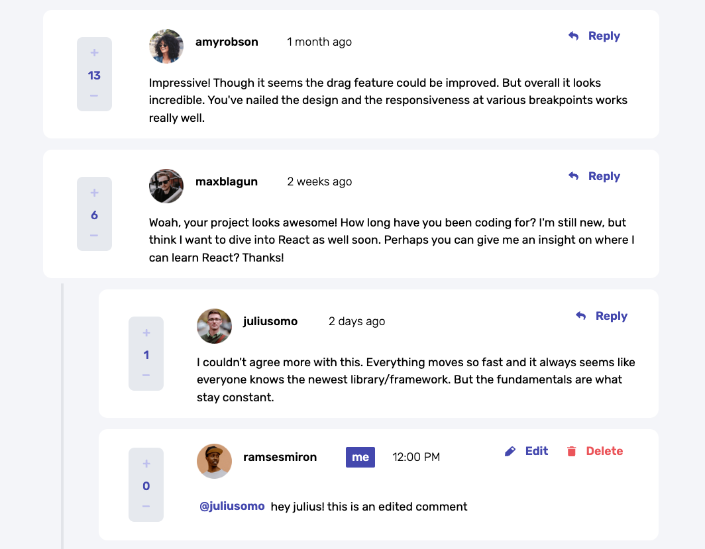
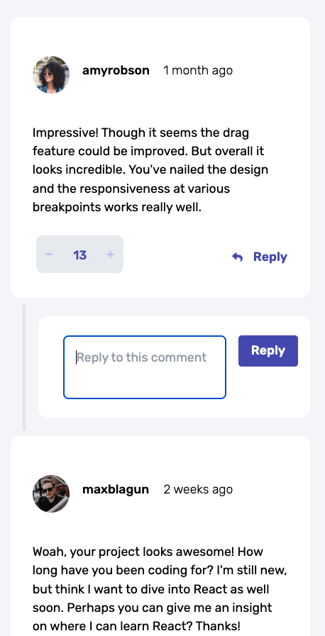
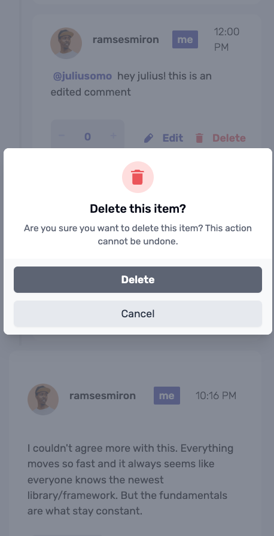

# Frontend Mentor - Interactive comments section solution

This is a solution to the [Interactive comments section challenge on Frontend Mentor](https://www.frontendmentor.io/challenges/interactive-comments-section-iG1RugEG9). Frontend Mentor challenges help you improve your coding skills by building realistic projects.

## Table of contents

- [Overview](#overview)
  - [The challenge](#the-challenge)
  - [Screenshot](#screenshot)
  - [Links](#links)
- [My process](#my-process)
  - [Built with](#built-with)
  - [What I learned](#what-i-learned)
  - [Continued development](#continued-development)
  - [Useful resources](#useful-resources)
- [Author](#author)
- [Acknowledgments](#acknowledgments)

**Note: Delete this note and update the table of contents based on what sections you keep.**

## Overview

### The challenge

Users should be able to:

- View the optimal layout for the app depending on their device's screen size
- See hover states for all interactive elements on the page
- Create, Read, Update, and Delete comments and replies
- Upvote and downvote comments
- **Bonus**: If you're building a purely front-end project, use `localStorage` to save the current state in the browser that persists when the browser is refreshed.
- **Bonus**: Instead of using the `createdAt` strings from the `data.json` file, try using timestamps and dynamically track the time since the comment or reply was posted.

### Screenshot





### Links

- Solution URL: [Add solution URL here](https://your-solution-url.com)
- Live Site URL: [Add live site URL here](https://your-live-site-url.com)

## My process

I built out this project using React, Redux and Tailwind. I used Redux to manage the global state of comments as well as the logged in user. I used Tailwind to style the components and add responsive styling. At a later date, this application could be plugged in and scaled to a larger application and have added features like user login, user profiles, and more.

### Built with

- [React](https://reactjs.org/) - JS library
- [Vite] (https://vitejs.dev/) - Build tool
- [Redux](https://redux.js.org/) - State management
- [Tailwind](https://tailwindcss.com/) - For styles

**Note: These are just examples. Delete this note and replace the list above with your own choices**

### What I learned

I ran into quite a few challenges, specifically with the counter logic and adding threads of replies while not violating DRY. I was able to solve these issues by using a combination of Redux and plain javascript, using a recursive function in my comment slice to easily find and update comments. I toyed with implementing the scoring in a separate slice, but decided to keep it in the comment slice for simplicity and ease of access. I also used a combination of Tailwind and custom CSS to style the components. I added a custom color palette into my Tailwind config, as well as custom classes, to achieve much of the desired design.

```js
function findCommentById(id, comments) {
  for (const comment of comments) {
    if (comment.id === id) {
      return comment
    }
    if (comment.replies) {
      const foundInReplies = findCommentById(id, comment.replies)
      if (foundInReplies) {
        return foundInReplies
      }
    }
  }
  return null
}
```

**Note: Delete this note and the content within this section and replace with your own learnings.**

### Continued development

I want to continue to focus on responsive-styling and Tailwind - in my next projects I will be doing a mobile-first approach, and will add tests for responsive-styling and accessibility. I also want to continue to improve my Redux skills, and will be working on a larger project in the near future that will require more complex state management. I also plan to add a React framework, like Next.js or Remix, as well as consistently implementing projects with Typescript (which I have learned but have not yet implemented in a larger project).

**Note: Delete this note and the content within this section and replace with your own plans for continued development.**

### Useful resources

- [React Docs](https://reactjs.org/docs/getting-started.html) - This helped me with the basics of React, and I used it to reference specific methods and properties.
- [Redux Docs](https://redux.js.org/) - This helped me with the basics of Redux, and I used it to reference specific methods and properties.
- [Tailwind Docs](https://tailwindcss.com/docs) - This helped me with the basics of Tailwind, and I used it to reference specific methods and properties.
- [Frontend Mentor](https://www.frontendmentor.io/) - This is where I found the challenge, and I used it to reference the design and requirements.
- [Frontend Masters](https://frontendmasters.com/) - This is where I learned React, Redux, and Tailwind.

**Note: Delete this note and replace the list above with resources that helped you during the challenge. These could come in handy for anyone viewing your solution or for yourself when you look back on this project in the future.**

## Author

I'm a developer working out of nyc! If you like what you see and want to work together, please shoot me a message on LinkedIn [here](https://www.linkedin.com/in/matthew-west-342b0965/)!

**Note: Delete this note and add/remove/edit lines above based on what links you'd like to share.**
